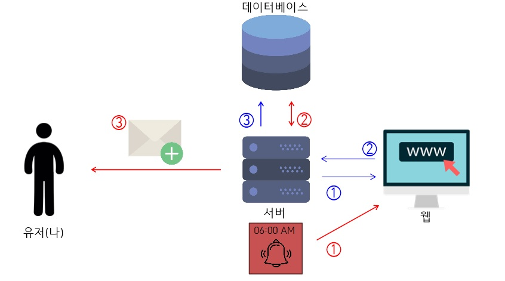
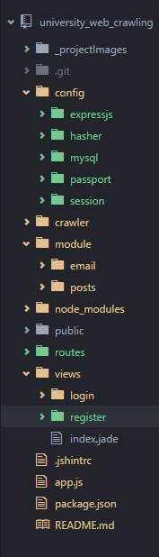

## node.js cheerio 모듈을 이용한 한신대학교 웹 크롤러
**본 문서는 미완성인(작성중인) 문서입니다. **

*할것 -링크 달기*

### 개요

** 한신대학교 홈페이지의 학사공지와 취업공지를 '매일 아침 6시' 에 크롤링하여 최신 게시글을 이메일을 통해 알림해준다.

### 대표적인 사용 모듈

    - cheerio, request
    - node-schedule
    - promise (javascript ES5 문법 사용)
    - nodemailer
    - mysql (pool connetion)

### 프로젝트 구조

- ***파란색 경로***

  - 최초로 서버를 실행할때, 진행 되어지는 로직

    1,2 : 웹서버는 [request](https://www.npmjs.com/package/request) 모듈을 통해 학사,취업 공지 page의 URL을 파라미터로 받아 HTML데이터를 요청하고 서버는 HTML 데이터를 받습니다.

    3 : 웹서버는 받은 HTML 데이터에서 [cheerio]() 모듈을 통해 마치 jQUERY처럼 데이터를 가져와서 게시글의 글번호, 제목, 작성날짜를 2차원 배열 자료구조에 저장 후, 데이터베이스 학교공지 테이블에 INSERT 해줍니다. 

- ***빨간색 경로***

  - 주기적으로 학교 공지 크롤링이 진행 되어지는 로직

    1 : 웹서버는 [node-schedule]() 모듈을 통해 현재 시각이 06시가 되면 위와 동일하게 HTML데이터를 요청하고 받습니다.

    2 : 데이터베이스는 학교공지 테이블에서 최신 글번호를 조회(SELECT)하여 수집한 HTML 데이터의 글번호와 비교하여 '학교공지 테이블에서 최신 글번호 < 수집한 HTML 데이터의 글번호 ' 일때,  수집한 html 데이터의 최신 게시글들을 테이블에 갱신해 주게 됩니다.

    3: 마지막으로 이렇게 갱신한 게시글의 URL들을 웹서버는 [nodemailer]() 모듈을 통해 유저(나)에게 메일을 전송하여 알림을 해주게 됩니다.

    ​

### 프로젝트 파일

#### 설명
* config
    * expressjs
    * hasher
    * mysql
    * passport
    * session
* crawler
* module
* app.js

## 확장할 점
1. 문자메세지 알림 기능 구현
2. 나 뿐만 아니라 많은 한신대 학생들이 사용할 수 있게 로그인 기능 구현
3. 사용자는 '키워드' 설정을 통해 특정 키워드의 게시물에 대한 알림만 받게 해주는 기능 구현

